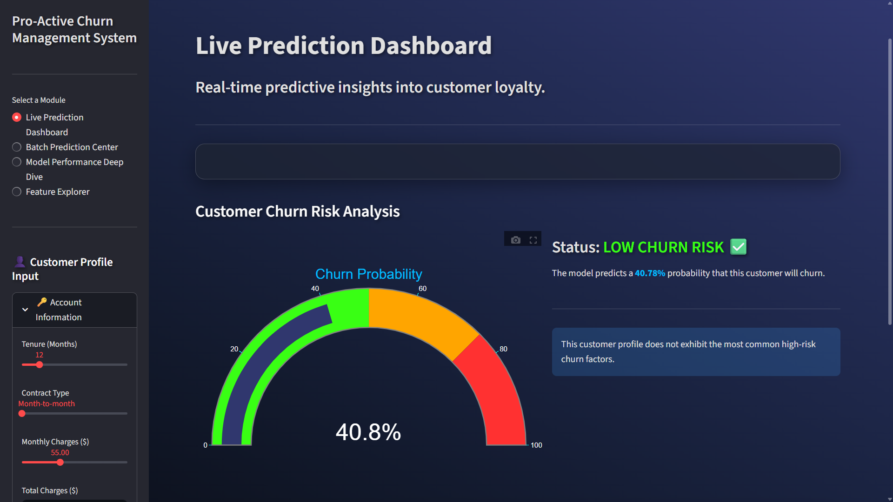
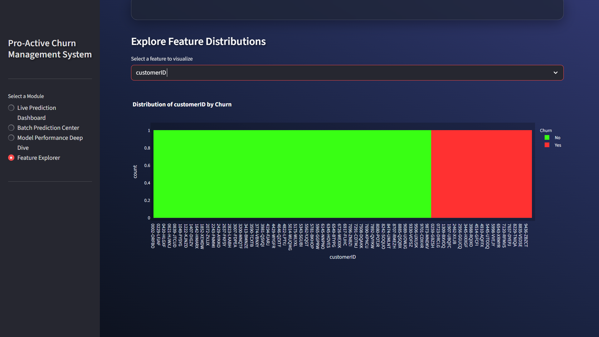

# 🔮 E-commerce Customer Churn Prediction  
> _"Turning data into insight — and insight into customer loyalty."_  

An **end-to-end Machine Learning system** designed to **predict customer churn** for a subscription-based e-commerce service.  
This project features a fully automated ML pipeline — from data ingestion and preprocessing to model training, evaluation, and a **multi-page interactive Streamlit web app** for real-time predictions.

---

## 🎬 Live Demo

✨ Below are snapshots of the deployed **Streamlit Application Interface**, showcasing different functional pages and insights.

<div align="center">
  <br>
  <em>📊 Main Dashboard — Predict churn probability for individual customers.</em>
  <br><br>
  <br>
  <em>📂 KPM (KEY PERFOMANCE METRICS) for the given dataset.</em>
  <br><br>
  <br>
  <em>📈 Feature exploration wrt to CustomerID.</em>
</div>

> 💡 Want to make your own GIF demo? Record your Streamlit app using  
> [🎥 ScreenToGIF](https://www.screentogif.com/) or [LICEcap](https://www.cockos.com/licecap/).

---

## 🧭 Table of Contents
- [Project Overview](#-project-overview)
- [Features](#-features)
- [Tech Stack & Libraries](#-tech-stack--libraries)
- [Project Architecture](#-project-architecture)
- [Setup & Installation](#-setup--installation)
- [Running the Application](#-running-the-application)
- [Results & Evaluation](#-results--evaluation)
- [Future Enhancements](#-future-enhancements)
- [License](#-license)

---

## 🧠 Project Overview

The main objective is to **identify customers likely to churn** (cancel their subscription) using their behavioral, demographic, and transactional data.  

Through a combination of **data science and business intelligence**, this model empowers the company to:
- Predict churn probabilities for every active user  
- Design personalized retention strategies (discounts, engagement campaigns)  
- Increase customer lifetime value  

The system is fully **modular and production-ready**, integrated with:
- **MLflow for experiment tracking**
- **Streamlit for live interaction**
- **Automated data pipelines** for retraining and deployment.

---

## ✨ Key Features
🚀 **End-to-End ML Pipeline**  
> Automated steps for data ingestion, cleaning, feature engineering, training, and evaluation.

🧹 **Data Cleaning & Preprocessing**  
> Smart handling of missing values, type conversions, and categorical encoding.

🧩 **Feature Engineering**  
> Dynamic creation of new variables like tenure groups, average spend, and service tiers.

🤖 **Multi-Model Training**  
> Benchmarked Logistic Regression, Random Forest, and XGBoost — with the best one auto-selected.

📊 **Experiment Tracking (MLflow)**  
> Logs all parameters, metrics, confusion matrices, and models for transparent experimentation.

🧮 **Model Evaluation Suite**  
> Generates performance metrics (Precision, Recall, F1, ROC-AUC) and visual reports.

🧠 **Streamlit App (Multi-Page)**  
> - 🔍 **Live Prediction:** Input a single customer’s details  
> - 📁 **Batch Prediction:** Upload CSV files for instant churn classification  
> - 🧾 **Model Insights:** Visualize key metrics and feature importance  
> - 📈 **Data Explorer:** Filter, sort, and visualize the underlying dataset

---

## 🛠️ Tech Stack & Libraries

| Layer | Technologies Used |
|:------|:------------------|
| **Language** | 🐍 Python 3.11+ |
| **Data & ML** | Pandas · NumPy · Scikit-learn · XGBoost |
| **Tracking & Workflow** | MLflow · PyYAML |
| **Visualization** | Plotly · Plotly Express |
| **Web Application** | Streamlit |
| **Versioning & Deployment** | GitHub · Streamlit Cloud / Docker |

---

## 🧱 Project Architecture
```bash
├── config/
│   └── config.yaml                # Configuration file for paths, hyperparameters, etc.
├── data/
│   ├── raw/
│   │   └── ecommerce_churn_data.csv
│   └── processed/
│       ├── train.csv
│       └── test.csv
├── reports/                       # Model evaluation plots, ROC curves, confusion matrices
├── saved_models/                  # Trained models and preprocessing objects (.pkl)
├── src/
│   ├── data_ingestion.py
│   ├── feature_engineering.py
│   ├── model_training.py
│   ├── model_evaluation.py
│   ├── pipeline.py
│   └── utils.py
├── app.py                         # Streamlit frontend
├── requirements.txt
└── README.md


---

## ⚙️ Setup & Installation

Clone the repository:
```bash
git clone https://github.com/yourusername/Ecommerce-Churn-Prediction.git
cd Ecommerce-Churn-Prediction

